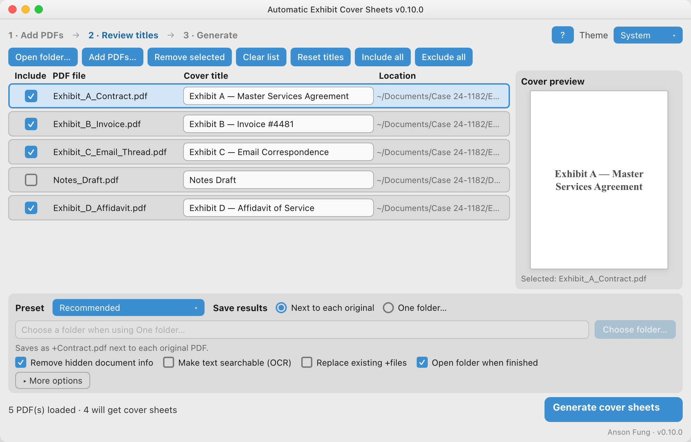

# Automatic Exhibit Cover Sheets



Add letter-sized cover sheets to PDFs. Primary UX is a **GUI list** (edit labels, generate with progress). Headless batch mode remains available for scripts.

**v0.9** — GUI rebuilt with CustomTkinter (modern layout, light/dark theme, custom job list).

## Install (from source)

```bash
python3 -m venv .venv
source .venv/bin/activate   # Windows: .venv\Scripts\activate
pip install -e ".[dev]"
```

Optional extras:

```bash
pip install -e ".[ocr]"        # ocrmypdf (also install system Tesseract)
pip install -e ".[optimize]"   # pikepdf for linearize + thorough metadata strip
pip install -e ".[full]"       # both
```

Or with the pinned runtime list only:

```bash
pip install -r requirements.txt
```

## First run (prebuilt binaries)

1. Download from the latest [release](https://github.com/uchi-ansonfung/Auto-Cover-Sheets-Script/releases).

   | Download | Who it’s for |
   |----------|----------------|
   | **`coversheets-<version>-windows-x64-setup.exe`** (recommended) | Windows users who want OCR + Linearize with no extra installs |
   | `coversheets-<version>-windows-x64.exe` | Portable slim Windows app (no bundled OCR engines) |
   | `coversheets-<version>-macos-arm64` | macOS Apple Silicon |

2. **Windows full installer:** run the setup, accept the defaults (per-user install, Start Menu shortcut). Launch from the Start Menu. OCR (English) and Linearize work out of the box — no Python, Tesseract, or Ghostscript install.
3. **Slim / portable / macOS:** double-click the binary. Windows SmartScreen may require More info → Run anyway. macOS: right-click → Open the first time (unsigned builds are blocked by Gatekeeper).

## Usage (GUI list — default)

```bash
coversheets
# or
python -m coversheets
# optional: preload a folder into the list
coversheets /path/to/pdfs
```

1. **Open a folder** or **Add PDFs** (or drag PDFs / a folder onto the window).
2. Check each **Cover title** (defaults to the filename without `.pdf`). A **cover preview** updates as you edit.
3. Use **Include** to choose which files to process; **Include all** / **Exclude all** help with large lists.
4. Choose where to save: **Next to each original** or **One folder…**
5. Common options stay visible (remove hidden document info, searchable OCR). Extra PDF knobs live under **More options**.
6. Click **Generate cover sheets**. Progress can be cancelled after the current file; when finished you can **Show in folder**.
7. Outputs are written **atomically** (temp `.partial` then rename). Default name: `+OriginalName.pdf`. Originals are never modified.

The first launch shows a short welcome. The GUI **remembers preferences** (options, theme, window size, last folder, etc.). Settings live under your user config directory (`~/Library/Application Support/coversheets/` on macOS, `%APPDATA%\\coversheets\\` on Windows, `~/.config/coversheets/` on Linux).

### Options (GUI labels → behavior)

| GUI label | Default | Notes |
|-----------|---------|--------|
| **Remove hidden document info** | on | Strips document Info + XMP |
| **Make text searchable (OCR)** | off | Needs full Windows installer (or `coversheets[ocr]` + Tesseract) |
| **Replace existing +files** | off | Overwrite prior outputs |
| **Open folder when finished** | on | GUI only |
| *More options →* Compress / shrink duplicates / faster web viewing | compress+optimize on; linearize off | Advanced; linearize needs full build / pikepdf |
| *More options →* Name output after cover title | off | `+Title.pdf` instead of `+OriginalName.pdf` |

## Usage (headless batch)

```bash
coversheets --batch /path/to/pdfs
coversheets /path/to/pdfs --dry-run
coversheets --batch /path/to/pdfs --force --no-compress -o /path/to/output
coversheets --batch /path/to/pdfs --rename-to-label
coversheets --batch /path/to/pdfs --strip-metadata --linearize
coversheets --batch /path/to/pdfs --no-optimize
coversheets --batch /path/to/pdfs --ocr --ocr-language eng
coversheets --batch /path/to/pdfs --no-strip-metadata
coversheets --version
```

| Flag | Meaning |
|------|---------|
| `folder` | Optional folder (GUI preload, or required with `--batch`) |
| `--gui` | Force GUI (default when not batching) |
| `--batch` | Headless process all PDFs in folder |
| `-o`, `--output-dir DIR` | Write `+Name.pdf` here (batch) |
| `--no-compress` | Skip lossless page-stream compression |
| `--force` | Overwrite existing `+Name.pdf` |
| `--rename-to-label` | Name outputs `+Label.pdf` |
| `--strip-metadata` / `--no-strip-metadata` | True metadata strip (default on) |
| `--optimize` / `--no-optimize` | Dedupe PDF objects (default on) |
| `--linearize` | Linearize output (pikepdf or qpdf) |
| `--ocr` | OCR with ocrmypdf |
| `--ocr-language LANG` | Tesseract language(s), default `eng` |
| `--ocr-force` | OCR even when text already exists |
| `-n`, `--dry-run` | Show plan only; implies batch |
| `-V`, `--version` | Print version and exit |

## What this program does

* Adds a letter-sized coversheet with centered text (36-pt Times Bold; wraps if needed).
* Cover text comes from the **editable label** in the GUI (or the filename stem in batch mode).
* Optional **true metadata strip** (document Info dictionary + XMP).
* Optional **OCR** path (ocrmypdf) so scanned bodies become text-searchable.
* Optional **optimize** (object dedupe) and **linearize** (fast web view).
* Optional **name output after label**.
* Continues after per-file errors and reports a summary.

## What this program doesn't do

* Does not modify the original PDFs.
* OCR/linearize extras are optional and disabled in the UI when dependencies are missing.

## Development

```bash
pip install -e ".[dev]"
pytest
```

### Layout

```
coversheets/
  __main__.py         # python -m coversheets
  gui/                # CustomTkinter UI (app, options, preview, welcome, dnd)
  cover.py            # cover sheet generation (ReportLab)
  merge.py            # prepend cover + write
  pdf_ops.py          # metadata strip, OCR, optimize, linearize
  bundled_tools.py    # frozen/installer Tesseract + Ghostscript PATH
  options.py          # ProcessOptions
  prefs.py            # GUI preference persistence
  process.py          # JobItem + batch processing
  cli.py              # argparse entry point
installer/windows/    # Inno Setup script
scripts/              # build_windows_full.ps1
tests/
pyproject.toml
```

## Release builds (CI)

Publishing a GitHub Release runs [`.github/workflows/release.yml`](.github/workflows/release.yml), which:

1. Runs tests on Windows + macOS (arm64)
2. Builds slim one-file PyInstaller binaries
3. Builds the **Windows full installer** (PyInstaller with `pikepdf` + `ocrmypdf`, staged Tesseract + Ghostscript, Inno Setup)
4. Attaches assets:
   - `coversheets-<version>-windows-x64-setup.exe` ← preferred for end users
   - `coversheets-<version>-windows-x64.exe`
   - `coversheets-<version>-macos-arm64`

You can also run the workflow manually (**Actions → Release builds → Run workflow**) to produce downloadable workflow artifacts without creating a release.

```bash
# Tag and publish a release (example)
git tag v0.10.0
git push origin v0.10.0
# Then create a Release from that tag in the GitHub UI (or: gh release create v0.10.0)
```

## Building locally (optional)

### Slim one-file binary

```bash
pip install -e ".[dev]"
pyinstaller coversheets.spec
# → dist/coversheets.exe  (Windows)
# → dist/coversheets      (macOS / Linux)
```

### Windows full installer (OCR + Linearize)

Requirements: Windows, Python 3.10+, [Inno Setup 6](https://jrsoftware.org/isinfo.php), and either:

- Chocolatey (script can install Tesseract, Ghostscript, Inno Setup), or
- Those tools already installed so the script can copy them into the payload

```powershell
python -m venv .venv
.\.venv\Scripts\activate
pip install -e ".[full,dev]"
powershell -ExecutionPolicy Bypass -File scripts\build_windows_full.ps1
# → dist\coversheets-<version>-windows-x64-setup.exe
# → dist\windows-full\   (staged payload used by Inno)
```

The frozen app looks next to `coversheets.exe` for `tesseract\` and `ghostscript\` and puts them on `PATH` automatically (`coversheets/bundled_tools.py`). It also sets `GS_LIB` / `GS_DLL` for the portable Ghostscript tree so scanned PDFs that use JBIG2 (`/JBIG2Decode`) can be rasterized — that path needs Ghostscript’s bundled jbig2dec support, not the optional `jbig2enc` encoder.
